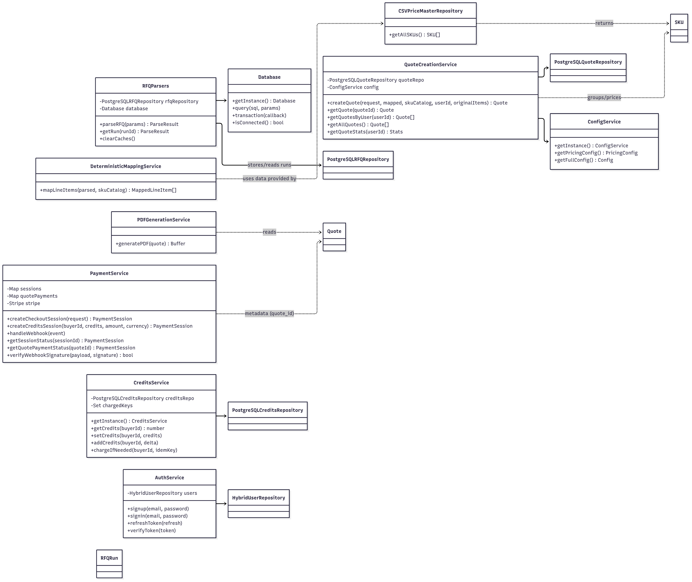
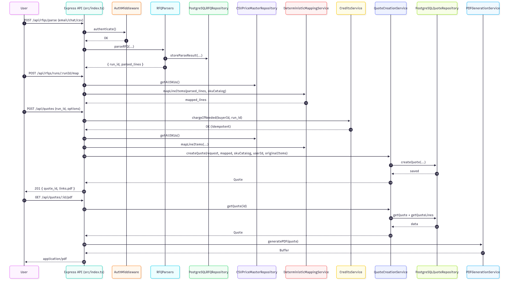
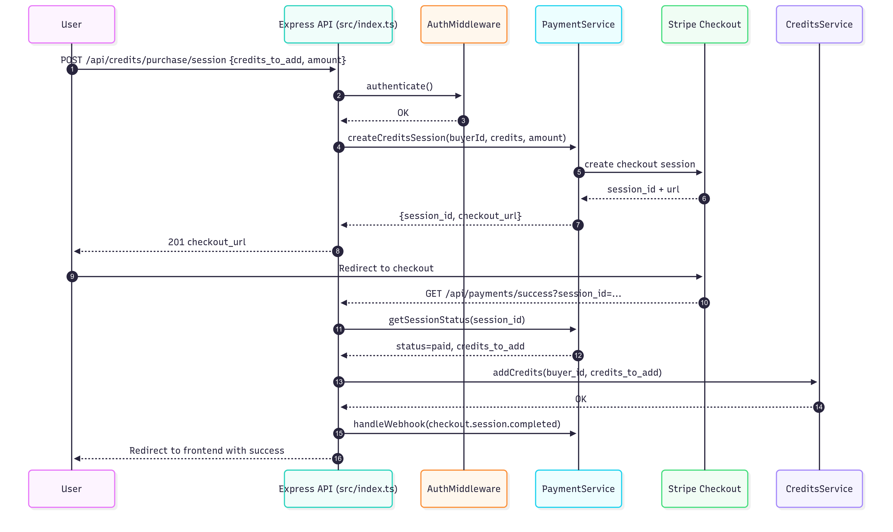

# Pactle Quote Generation System

An automated quote generation system for manufacturers that converts messy RFQs (Request for Quotations) into accurate, professional quotes with deterministic SKU mapping and pricing.

## Features

- **Multi-format RFQ Processing**: Supports email text, chat messages, and CSV files
- **Deterministic SKU Mapping**: Advanced fuzzy matching with explainability
- **Accurate Pricing**: Automated pricing with discounts, taxes, and freight calculation
- **Multiple Output Formats**: PDF, JSON, and CSV generation
- **ERP Integration**: Ready for ERP sync with idempotency
- **Audit Trail**: Complete explainability and assumptions tracking

## Quick Start

### One-Command Setup (Docker Compose)

Run the entire stack (frontend, backend, and Postgres) with a single command:

```bash
docker-compose up -d --build
```

Once the containers are healthy:

- Frontend (Web UI): http://localhost:3001
- Backend API health: http://localhost:3000/health
- PostgreSQL: localhost:5432 (user: postgres, password: postgres, db: pactle_db)

Useful commands:

```bash
# View logs
docker-compose logs -f

# Stop and remove containers
docker-compose down

# Rebuild after changes
docker-compose up -d --build
```

The compose file (`docker-compose.yml`) maps the services as follows:

- Frontend: `3001:3001` with `REACT_APP_API_URL=http://localhost:3000`
- Backend: `3000:3000` (Express API)
- Database: `5432:5432` (PostgreSQL 16 with volume `pgdata`)

### Local Development

```bash
# Install dependencies
make install

# Setup environment
cp .env.example .env

# Build and test
make build
make test

# Run in development mode
make run
```

## API Endpoints

All protected endpoints require JWT auth: include `Authorization: Bearer <token>`.

### Authentication
```bash
POST /api/auth/signup
POST /api/auth/signin
GET  /api/auth/me
POST /api/auth/refresh
```

### RFQ Processing
```bash
# Parse RFQ (text, csv, or json) — returns a runId
POST /api/rfqs/parse
Content-Type: multipart/form-data | application/json | text/plain
Authorization: Bearer <token>

# Get a specific parse run
GET /api/rfqs/runs/:runId
Authorization: Bearer <token>

# Map parsed items deterministically
POST /api/rfqs/runs/:runId/map
Authorization: Bearer <token>
```

### Quotes
```bash
# Create quote from a mapped RFQ run
POST /api/quotes
Authorization: Bearer <token>

# List quotes for current user
GET /api/quotes
Authorization: Bearer <token>

# Get one quote
GET /api/quotes/:quoteId
Authorization: Bearer <token>

# Download PDF
GET /api/quotes/:quoteId/pdf
Authorization: Bearer <token>
```

### Credits & Payments (Stripe-only)
```bash
# Get credits balance
GET /api/credits
Authorization: Bearer <token>

# Create Stripe checkout session and receive checkout_url
POST /api/credits/purchase/session
Authorization: Bearer <token>

# Webhooks
POST /api/payments/webhook
```

### Utilities
```bash
GET /health
GET /api/config           # requires auth
GET /api/dashboard/stats  # requires auth
GET /api/schemas          # requires auth
```

## Authentication Notes

- All sensitive endpoints are protected by JWT middleware and scoped to the authenticated user.
- Frontend and API calls must include `Authorization: Bearer <token>`.

## Configuration

Key environment variables:

```bash
# Business Rules
DEFAULT_MATERIAL_CORRUGATED=PP
DEFAULT_GAUGE_PVC=L
DEFAULT_VALIDITY_DAYS=30
DEFAULT_GST_PERCENT=18

# Freight Rules
FREIGHT_THRESHOLD=50000
FREIGHT_AMOUNT_BELOW_THRESHOLD=1000
FREIGHT_AMOUNT_ABOVE_THRESHOLD=0

# SKU Mapping
SKU_MAPPING_THRESHOLD=0.7
SKU_MAPPING_MARGIN_THRESHOLD=0.1
SIZE_TOLERANCE_MM=2
```

## Data Files

- `data/price_master.csv` - Product catalog with SKUs, prices, and specifications
- `data/taxes_v2.csv` - HSN code to GST percentage mapping
- `data/sku_alias.csv` - Alternative names and aliases for products

## Architecture

The system follows SOLID principles with clean architecture:

- **Domain Layer**: Core business entities and rules
- **Service Layer**: Business logic and orchestration  
- **Infrastructure Layer**: Data access and external integrations
- **API Layer**: REST endpoints and request handling

## Low-Level Design (UML)

This section documents the core classes/services, repositories, and request flows. Diagrams are generated using Mermaid, which renders on GitHub.

### Class Diagram (Core Components)



Key references in code:

- `src/index.ts` wires Express routes to services: `RFQParsers`, `DeterministicMappingService`, `CSVPriceMasterRepository`, `QuoteCreationService`, `PDFGenerationService`, `PaymentService`, `CreditsService`, `AuthService`, and `ConfigService`.
- `src/services/QuoteCreationService.ts` persists and reads quotes via `PostgreSQLQuoteRepository` and uses `ConfigService` for pricing and freight rules.
- `src/services/parsers.ts` parses RFQs and persists parse runs via `PostgreSQLRFQRepository` and `Database`.
- `src/services/CreditsService.ts` enforces idempotent credit charging via `PostgreSQLCreditsRepository`.
- `src/services/PaymentService.ts` integrates with Stripe to manage sessions and webhooks.
- `src/services/PDFGenerationService.ts` renders professional PDFs from Quote data.

### Sequence Diagram: RFQ → Mapping → Quote → PDF



### Sequence Diagram: Buy Credits via Stripe



### Notes

- All sensitive endpoints are protected by `AuthMiddleware` and use the authenticated `user.id` for isolation.
- `CreditsService.chargeIfNeeded()` ensures one-credit deduction per RFQ-to-Quote attempt using an idempotency key.
- Payment is Stripe-only; mock/fallback flows have been removed.
- PDF includes both original RFQ items and grouped quote items for transparency.

## Testing

```bash
# Run all tests
make test

# Run with coverage
make test-coverage

# Watch mode for development
make test-watch
```

## Sample Outputs

The system generates three output formats for each quote:

1. **PDF**: Professional quote document with company branding
2. **JSON**: Structured data for API consumption and ERP sync
3. **CSV**: Tabular format for spreadsheet analysis

## Acceptance Criteria

The system passes all acceptance tests including:

- ✅ Exact SKU mapping for standard products
- ✅ Material inference with proper defaults
- ✅ FRPP material detection and pricing
- ✅ Coil to meter conversion
- ✅ Alias-based matching
- ✅ "Needs Review" handling for ambiguous items
- ✅ Header discount application
- ✅ Freight rule evaluation
- ✅ Idempotency for duplicate requests

## Performance

- Processes ≤200 line items in under 3 seconds
- Memory efficient with deterministic results
- 99.5%+ accuracy on provided test cases

## Development

### Project Structure
```
src/
├── domain/           # Core business logic
├── services/         # Application services
├── infrastructure/   # Data access layer
└── index.ts         # API endpoints

data/                # CSV data files
samples/             # Sample RFQ inputs
tests/               # Test files
```

### Adding New Product Families

1. Update `data/price_master.csv` with new SKUs
2. Add aliases in `data/sku_alias.csv`
3. Update family detection patterns in parsers
4. No code changes required!